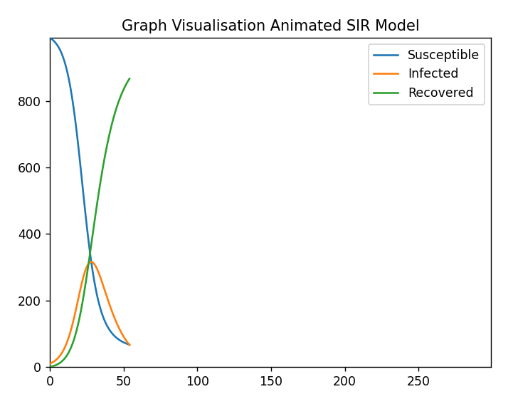
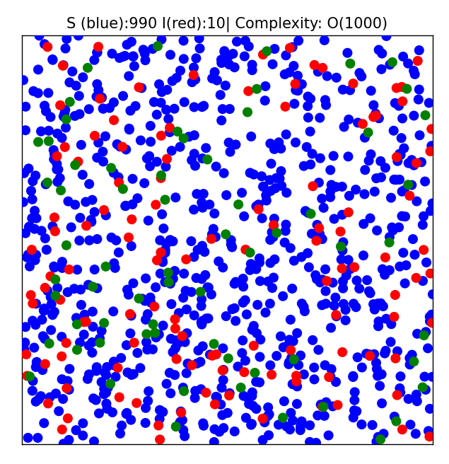
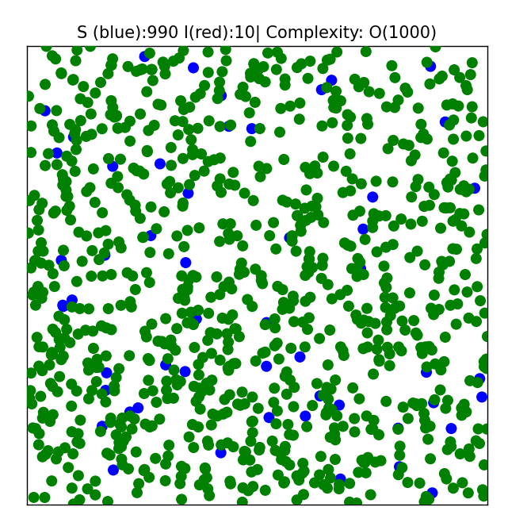
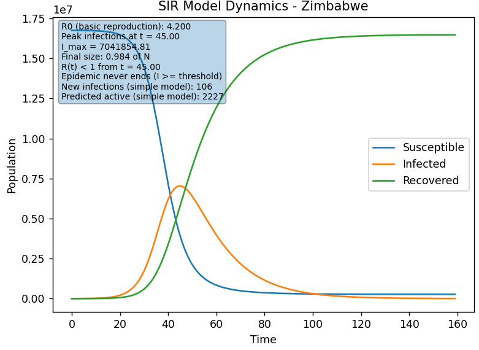

# Simulimi i Përhapjes së Epidemive – Modeli SIR

Ky projekt implementon simulime të përhapjes së epidemive duke përdorur modelet **SIR**, **SEIR** dhe **stohastike**. Projekti përfshin algoritme si **Euler** dhe **Runge–Kutta i rendit të katërt (RK4)**, metoda të ndryshme vizualizimi, një ndërfaqe interaktive në komandë (CLI), skenarë të bazuar në të dhëna reale të **COVID-19**, si dhe **gjashtë eksperimente algoritmike** për analizimin e konvergjencës, kompleksitetit dhe ndjeshmërisë ndaj parametrave.

Ky projekt është i dizajnuar me fokus në lëndën **Dizajni dhe Analiza e Algoritmeve** dhe në sjelljen numerike të modeleve epidemiologjike.

---

## Struktura e Projektit

Projekti është i organizuar në këto dosje dhe skedarë kryesorë:

### sir/

Kjo dosje përmban të gjitha modulet bazë të simulimit:

- **model.py**  
  Implementon modelin deterministik **SIR** duke përdorur metodat numerike **Euler** dhe **RK4**.  
  Përfshin funksione për:
  - kohën e kulmit të infektimit,
  - madhësinë përfundimtare të epidemisë,
  - dinamikën e shërimit,
  - llogaritjen e numrit efektiv të riprodhimit \( R_t \),
  - kohëzgjatjen e epidemisë.  

  Rezultatet ruhen në një **DataFrame** me kolonat:
  - time
  - S (Susceptible)
  - I (Infected)
  - R (Recovered)

- **variants.py**  
  Përmban variante të tjera të modelit:
  - **StochasticSIR** – model stohastik që fut rastësinë përmes shpërndarjes binomiale për infektimet dhe shërimet.
  - **SEIR** – model me katër kompartimente epidemiologjike:  
    \( S \rightarrow E \rightarrow I \rightarrow R \)

- **visualization.py**  
  Ofron vizualizim të animuar me grafikë lineare që tregojnë evolucionin e popullatës \( S, I, R \) në kohë.

- **visualization_dots.py**  
  Ofron vizualizim të stilit “human”, ku çdo individ përfaqësohet nga një pikë me ngjyrë:
  - blu – individë të ndjeshëm (S),
  - e kuqe – individë të infektuar (I),
  - e gjelbër – individë të shëruar (R).

- **experiments.py**  
  Përmban **gjashtë eksperimente të paracaktuara** për analizë numerike dhe algoritmike, si:
  - studime konvergjence,
  - matje të kompleksitetit kohor,
  - analiza të ndjeshmërisë ndaj parametrave,
  - skenarë të imunitetit të tufës.  

  Rezultatet ruhen automatikisht në dosjen **experiments_output**.

---

### covid_data/

Kjo dosje përmban skedarin **country_wise_latest.csv**, i cili përdoret për skenarë simulimi të bazuar në të dhëna reale të **COVID-19**.  
Përdoruesi zgjedh një shtet dhe ndërtohet një model **SIR** në bazë të të dhënave përkatëse të popullsisë, rasteve aktive, të shëruarve dhe vdekjeve.

---

### experiments_output/

Kjo dosje përmban të gjitha rezultatet e gjeneruara nga moduli i eksperimenteve, duke përfshirë:

- tabela **CSV** me vlera numerike,
- figura **PNG** për:
  - konvergjencën e metodave numerike,
  - kompleksitetin kohor,
  - analizat e parametrave,
  - efektet e \( \beta \) dhe \( \gamma \),
  - skenarët e imunitetit të tufës.

---

### main.py

Ky është skedari kryesor i ekzekutimit të projektit.  
Ai ofron një **menu interaktive**, përmes së cilës përdoruesi mund të ekzekutojë:

- simulime manuale **SIR** me parametra të zgjedhur nga përdoruesi,
- skenarë të paracaktuar duke përdorur të dhëna reale të **COVID-19**,
- simulime **SIR stohastike**,
- simulime **SEIR**.

Gjithashtu, për secilën simulim janë të disponueshme disa mënyra vizualizimi:
- grafikë të animuar me vija,


- vizualizim me pika që përfaqësojnë individë,
 


- grafikë statike.


---

## Përshkrimi i Gjashtë Eksperimenteve

Eksperimentet e implementuara në `sir/experiments.py` janë:

### 1. Studimi i Konvergjencës
Krahason metodat **Euler** dhe **RK4** për madhësi të ndryshme të hapit kohor \( dt \).  
Tregon se si saktësia rritet kur \( dt \) zvogëlohet dhe se **RK4 konvergon më shpejt** se metoda Euler.


### 2. Eksperimenti i Kompleksitetit Kohor
Mat kohën e ekzekutimit të simulimit në varësi të numrit të hapave numerikë.  
Demonstron se kompleksiteti kohor rritet **linearisht** me raportin \( T / dt \).


### 3. Analiza e parametrave (Parameter Sweep)
Ekzekuton modelin **SIR** për një rrjet vlerash të \( \beta \) dhe \( \gamma \).  
Regjistron kulmin e infektimit dhe krijon **heatmap** për të vizualizuar ndjeshmërinë e sistemit ndaj parametrave.


### 4. Efekti i parametrit Beta
Tregon se rritja e normës së transmetimit \( \beta \):
- shkakton epidemi më të hershme,
- rrit numrin maksimal të të infektuarve,
- përshpejton përhapjen e sëmundjes.


### 5. Efekti i parametrit Gamma
Tregon se rritja e normës së shërimit \( \gamma \):
- ul intensitetin e epidemisë,
- zvogëlon kulmin e infektimit,
- përshpejton përfundimin e epidemisë.


### 6. Skenari i Imunitetit të tufës
Ndryshon numrin fillestar të individëve të shëruar për të demonstruar se:
- imuniteti paraprak mund të dobësojë përhapjen e epidemisë,
- ose ta parandalojë plotësisht atë.


---

## Si të Ekzekutohet Projekti
- Ekzekutimi i programit interaktiv:  
```bash
python main.py
````
- Ekzekutimi i eksperimenteve:     
```bash
python -m sir.experiments
```

### Instalimi i varësive

```bash
pip install numpy pandas matplotlib
```
